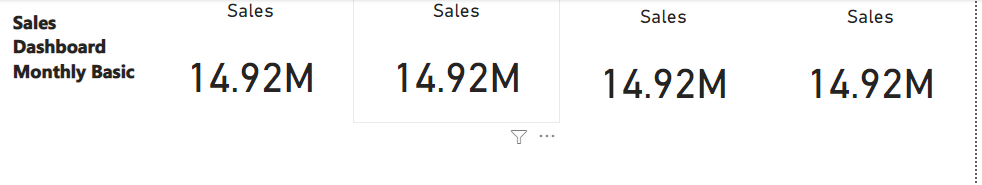

# Power_BI_Dashboard
 
# Stage 1 
**Creating 4 KPI's for Dashboard**
 - No need to focus on formating
 - Creating 4 Important KPI's for Dashboard
 
 

 
 # Stage 2 
 **Creating Charts**
 - Create different charts based on data available
 - Chart Layout ( Title , Label , Colour)
 
 
 
 
 # Stage 3 
 **Creating Dashboard**
 - Arrange all KPI's and Chart on Dashboard
 - Creating Nevigate Panal
 - Creating Dynamic charts or details ( Nevigation Button )
 - We can nevigate between pages useing buttons.
 - Focus on formating
 - Focus on Fonts , Spacing.
 

# Stage 4
 **Final Dashboard**
 - FInal Dashboardis ready.
 
 